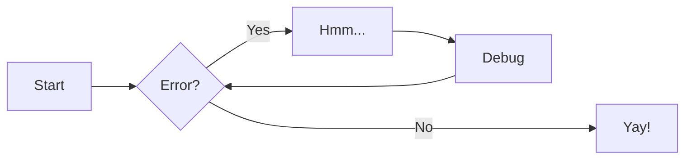

# Markdown

> For more information go to [documentation](https://zensical.org/docs/authoring/markdown/)

## Basics

### Headers

```text
# H1 Header
## H2 Header
### H3 Header
#### H4 Header
##### H5 Header
###### H6 Header
```

### Text Formatting

```text
**bold text**
*italic text*
***bold and italic***
~~strikethrough~~
`inline code`
```

### Links and Images

```text
[Link text](https://example.com)
[Link with title](https://example.com "Hover title")


```

### Lists

```text
Unordered:

- Item 1
- Item 2
  - Nested item

Ordered:

1. First item
2. Second item
3. Third item
```

### Task Lists

```text
- [x] Completed task
- [ ] Incomplete task
- [ ] Another task
```

### Blockquotes

```text
> This is a blockquote
> Multiple lines
>> Nested quote
```

### Code Blocks

````
```javascript
function hello() {
  console.log("Hello, world!");
}
```
````

### Tables

```text
| Header 1 | Header 2 | Header 3 |
|----------|----------|----------|
| Row 1    | Data     | Data     |
| Row 2    | Data     | Data     |
```

### Horizontal Rule

```text
---
or
***
or
___
```

### Line Breaks

```text
End a line with two spaces
to create a line break.

Or use a blank line for a new paragraph.
```

### Icons and Emojis

- :sparkles: `:sparkles:`
- :rocket: `:rocket:`
- :tada: `:tada:`
- :memo: `:memo:`
- :eyes: `:eyes:`

### Tooltips

> Go to [documentation](https://zensical.org/docs/authoring/tooltips/)

[Hover me][example]

[example]: https://example.com "I'm a tooltip!"

### Footnotes

Here's a sentence with a footnote.[^1]

Hover it to see a tooltip.

### Admonitions

!!! note

    This is a **note** admonition. Use it to provide helpful information.

!!! warning

    This is a **warning** admonition. Be careful!

### Collapsible Blocks

??? info "Click to expand for more info"

    This content is hidden until you click to expand it.
    Great for FAQs or long explanations.

## Advanced

### Escaping Characters

```text
Use backslash to escape: \* \_ \# \`
```

### Code Annotations

```python hl_lines="2" title="Code blocks"
def greet(name):
    print(f"Hello, {name}!") # (1)!

greet("Python")
```

1. Code annotations allow you to attach notes to lines of code.

Code can also be highlighted inline: `#!python print("Hello, Python!")`.

### Content Tabs

=== "Python"

    ``` python
    print("Hello from Python!")
    ```

=== "Rust"

    ``` rs
    println!("Hello from Rust!");
    ```

### Diagrams



### Advanced Formatting

- ==This was marked (highlight)==
- ^^This was inserted (underline)^^
- ~~This was deleted (strikethrough)~~
- H~2~O
- A^T^A
- ++ctrl+alt+del++

### Math

$$
\cos x=\sum_{k=0}^{\infty}\frac{(-1)^k}{(2k)!}x^{2k}
$$

!!! warning "Needs configuration"

Note that MathJax is included via a `script` tag below and is not configured by default to avoid including it on pages that do not need it. See the Zensical documentation for details on how to configure it on all your pages if they are more math-heavy.

<script id="MathJax-script" src="https://unpkg.com/mathjax@3/es5/tex-mml-chtml.js"></script>
<script>
  window.MathJax = {
    tex: {
      inlineMath: [["\\(", "\\)"]],
      displayMath: [["\\[", "\\]"]],
      processEscapes: true,
      processEnvironments: true
    },
    options: {
      ignoreHtmlClass: ".*|",
      processHtmlClass: "arithmatex"
    }
  };

  document$.subscribe(() => {
    MathJax.startup.output.clearCache()
    MathJax.typesetClear()
    MathJax.texReset()
    MathJax.typesetPromise()
  })
</script>

---

[^1]: This is the footnote.
